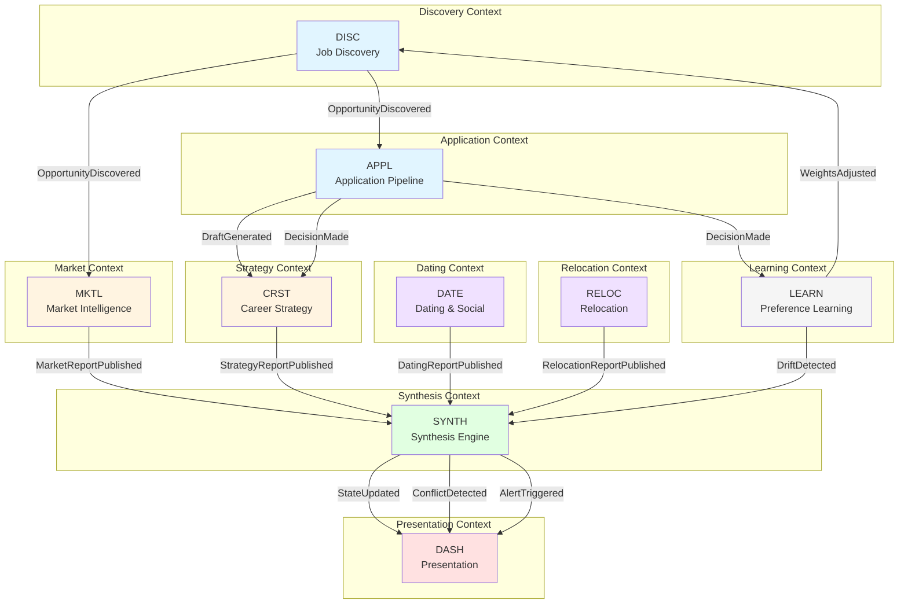

# Life Systems - Architecture Specification

**Version**: 1.0.0  
**Created**: 2026-02-20  
**Status**: CANONICAL REFERENCE  

---

## Overview

Life Systems is a Domain-Driven Design (DDD) implementation of a personal decision intelligence platform. Nine bounded contexts coordinate through domain events and Anti-Corruption Layers (ACLs) to provide unified strategic guidance across career, market intelligence, application automation, dating/social life, and relocation decisions.

**Key principles**:
- Bounded contexts are **fully isolated** (no shared databases, no direct dependencies)
- Communication via **domain events** only (versioned JSON schemas)
- ACLs enforce **strict translation boundaries** (no leaky abstractions)
- Each context has **autonomous storage** (SQLite per context)
- Presentation layer consumes **synthesized state only** (never raw advisor outputs)

---

## Context Map



**Legend**:
- Blue: Discovery & Application (job pipeline)
- Yellow: Strategic advisors (career, market)
- Purple: Lifestyle advisors (dating, relocation)
- Green: Integration layer (synthesis)
- Red: Presentation layer (dashboard, widgets)
- Gray: Cross-cutting (learning, preferences)

---

## Bounded Contexts

### 1. DISC (Discovery)
**Responsibility**: Multi-source job aggregation, deduplication, scoring  
**Publishes**: `OpportunityDiscovered`, `OpportunityScored`  
**Consumes**: `WeightsAdjusted` (from LEARN)  
**Storage**: `disc.db` (listings, sources, scan history)  
**Dependencies**: Job board APIs, Brave Search API  

### 2. APPL (Application Pipeline)
**Responsibility**: Draft generation, humanization, approval queue  
**Publishes**: `DraftGenerated`, `DecisionMade`  
**Consumes**: `OpportunityScored` (via OpportunityQualifier ACL)  
**Storage**: `appl.db` (drafts, decisions, humanizer rules)  
**Dependencies**: Claude API, Slack SDK  

### 3. CRST (Career Strategy)
**Responsibility**: Funnel analysis, channel effectiveness, pivot recommendations  
**Publishes**: `StrategyReportPublished`  
**Consumes**: `DraftGenerated`, `DecisionMade`  
**Storage**: `crst.db` (decisions, funnels, metrics)  
**Dependencies**: None  

### 4. MKTL (Market Intelligence)
**Responsibility**: Skill demand tracking, salary analysis, gap detection  
**Publishes**: `MarketReportPublished`  
**Consumes**: `OpportunityDiscovered`  
**Storage**: `mktl.db` (skills, trends, salary data)  
**Dependencies**: None  

### 5. DATE (Dating & Social)
**Responsibility**: Activity tracking, event discovery, reflection prompts  
**Publishes**: `DatingReportPublished`  
**Consumes**: None (self-contained via SignalCollector)  
**Storage**: `date.db` (activities, events, streaks)  
**Dependencies**: Apple Health API, event discovery APIs  

### 6. RELOC (Relocation)
**Responsibility**: City comparison, tax modeling, lifestyle scenarios  
**Publishes**: `RelocationReportPublished`  
**Consumes**: None (external data sources only)  
**Storage**: `reloc.db` (cities, models, scenarios)  
**Dependencies**: Cost of living APIs, tax calculators  

### 7. SYNTH (Synthesis Engine)
**Responsibility**: Multi-advisor aggregation, conflict detection, alert firing  
**Publishes**: `StateUpdated`, `ConflictDetected`, `AlertTriggered`  
**Consumes**: `MarketReportPublished`, `StrategyReportPublished`, `DatingReportPublished`, `RelocationReportPublished`, `DriftDetected`  
**Storage**: `synth.db` (synthesized state, conflicts, alerts)  
**Dependencies**: None  

### 8. DASH (Presentation)
**Responsibility**: Web dashboard, iOS widgets, view rendering  
**Publishes**: None  
**Consumes**: `StateUpdated`, `ConflictDetected`, `AlertTriggered` (via ViewModelMapper ACL)  
**Storage**: None (stateless view layer)  
**Dependencies**: GitHub Pages, Scriptable app  

### 9. LEARN (Preference Learning)
**Responsibility**: Weight tuning, drift detection, feedback loops  
**Publishes**: `WeightsAdjusted`, `DriftDetected`  
**Consumes**: `DecisionMade`, `StateUpdated`  
**Storage**: `learn.db` (weights, decisions, drift metrics)  
**Dependencies**: scikit-learn (logistic regression)  

---

## Domain Events (Versioned Schemas)

All events follow the structure:
```json
{
  "event_type": "string",
  "version": "v1",
  "timestamp": "ISO8601",
  "context": "string (DISC|APPL|CRST|MKTL|DATE|RELOC|SYNTH|LEARN)",
  "payload": {}
}
```

### OpportunityDiscovered (v1)
**Published by**: DISC  
**Consumed by**: APPL (via OpportunityQualifier), MKTL  

```json
{
  "event_type": "OpportunityDiscovered",
  "version": "v1",
  "timestamp": "2026-02-20T11:00:00Z",
  "context": "DISC",
  "payload": {
    "listing_id": "uuid",
    "company": "string",
    "role": "string",
    "description": "string",
    "location": "string (remote|hybrid|onsite)",
    "salary_range": {"min": 0, "max": 0, "currency": "EUR"},
    "tech_stack": ["string"],
    "seniority": "string (junior|mid|senior|staff|principal)",
    "sources": ["string"],
    "discovered_at": "ISO8601",
    "url": "string"
  }
}
```

### OpportunityScored (v1)
**Published by**: DISC  
**Consumed by**: APPL (via OpportunityQualifier ACL)  

```json
{
  "event_type": "OpportunityScored",
  "version": "v1",
  "timestamp": "2026-02-20T11:05:00Z",
  "context": "DISC",
  "payload": {
    "listing_id": "uuid",
    "score": 0-100,
    "breakdown": {
      "remote_match": 0-100,
      "ai_ml_relevance": 0-100,
      "seniority_match": 0-100,
      "salary_match": 0-100,
      "fintech_bonus": 0-20
    },
    "weights": {
      "remote_match": 0.0-1.0,
      "ai_ml_relevance": 0.0-1.0,
      "seniority_match": 0.0-1.0,
      "salary_match": 0.0-1.0,
      "fintech_bonus": 0.0-1.0
    },
    "rejected": false,
    "rejection_reason": "string|null"
  }
}
```

### DraftGenerated (v1)
**Published by**: APPL  
**Consumed by**: CRST  

```json
{
  "event_type": "DraftGenerated",
  "version": "v1",
  "timestamp": "2026-02-20T11:10:00Z",
  "context": "APPL",
  "payload": {
    "draft_id": "uuid",
    "listing_id": "uuid",
    "company": "string",
    "role": "string",
    "draft_text": "string",
    "humanizer_pass": true,
    "ai_tells_detected": 0,
    "word_count": 0,
    "variant": "string (fintech|ml_research|platform)"
  }
}
```

### DecisionMade (v1)
**Published by**: APPL  
**Consumed by**: CRST, LEARN  

```json
{
  "event_type": "DecisionMade",
  "version": "v1",
  "timestamp": "2026-02-20T11:15:00Z",
  "context": "APPL",
  "payload": {
    "draft_id": "uuid",
    "listing_id": "uuid",
    "decision": "string (approved|rejected|deferred)",
    "reason": "string|null",
    "applied_at": "ISO8601|null",
    "response_received": false,
    "response_at": "ISO8601|null"
  }
}
```

### MarketReportPublished (v1)
**Published by**: MKTL  
**Consumed by**: SYNTH (via AdvisorAdapter)  

```json
{
  "event_type": "MarketReportPublished",
  "version": "v1",
  "timestamp": "2026-02-20T12:00:00Z",
  "context": "MKTL",
  "payload": {
    "week": "2026-W08",
    "top_skills": [
      {
        "skill": "string",
        "demand_count": 0,
        "trend": "string (rising|stable|falling)",
        "required_vs_nice": {"required": 0, "nice_to_have": 0}
      }
    ],
    "salary_ranges": [
      {
        "role_type": "string",
        "min": 0,
        "max": 0,
        "median": 0,
        "currency": "EUR",
        "sample_size": 0
      }
    ],
    "gap_analysis": {
      "jurek_has": ["string"],
      "market_wants": ["string"],
      "gaps": ["string"]
    },
    "sample_size": 0
  }
}
```

### StrategyReportPublished (v1)
**Published by**: CRST  
**Consumed by**: SYNTH (via AdvisorAdapter)  

```json
{
  "event_type": "StrategyReportPublished",
  "version": "v1",
  "timestamp": "2026-02-20T12:00:00Z",
  "context": "CRST",
  "payload": {
    "week": "2026-W08",
    "funnel": {
      "discovered": 0,
      "applied": 0,
      "response": 0,
      "interview": 0,
      "offer": 0
    },
    "channel_breakdown": [
      {
        "channel": "string (linkedin|upwork|direct|referral)",
        "discovered": 0,
        "applied": 0,
        "response_rate": 0.0
      }
    ],
    "stale_leads": [
      {
        "company": "string",
        "role": "string",
        "days_since_apply": 0
      }
    ],
    "pivot_recommendation": {
      "action": "string (pause|double|pivot)",
      "channel": "string",
      "reason": "string",
      "confidence": 0.0-1.0
    }
  }
}
```

### DatingReportPublished (v1)
**Published by**: DATE  
**Consumed by**: SYNTH (via AdvisorAdapter)  

```json
{
  "event_type": "DatingReportPublished",
  "version": "v1",
  "timestamp": "2026-02-20T12:00:00Z",
  "context": "DATE",
  "payload": {
    "week": "2026-W08",
    "hours_vs_target": {
      "actual": 0,
      "target": 0,
      "categories": {
        "dating_apps": 0,
        "bachata": 0,
        "social_events": 0,
        "gym": 0,
        "other": 0
      }
    },
    "streaks": {
      "gym": 0,
      "social": 0
    },
    "upcoming_events": [
      {
        "title": "string",
        "date": "ISO8601",
        "location": "string",
        "type": "string (bachata|social|tech)"
      }
    ],
    "reflection_prompt": "string",
    "location_effectiveness": {
      "city": "string",
      "matches_per_week": 0,
      "dates_this_month": 0,
      "events_available": 0
    }
  }
}
```

### RelocationReportPublished (v1)
**Published by**: RELOC  
**Consumed by**: SYNTH (via AdvisorAdapter)  

```json
{
  "event_type": "RelocationReportPublished",
  "version": "v1",
  "timestamp": "2026-02-20T12:00:00Z",
  "context": "RELOC",
  "payload": {
    "comparison": [
      {
        "city": "string",
        "cost_of_living": 0,
        "net_income_estimate": 0,
        "dating_pool_proxy": 0,
        "tech_scene": "string (strong|moderate|weak)",
        "tax_rate": 0.0,
        "beckham_eligible": false,
        "confidence": {
          "cost_of_living": "string (high|med|low)",
          "dating_pool": "string (high|med|low)",
          "tax_model": "string (high|med|low)"
        }
      }
    ],
    "scenario": {
      "salary_input": 0,
      "city": "string",
      "disposable_income": 0,
      "lifestyle_tier": "string (premium|comfortable|budget)"
    }
  }
}
```

### StateUpdated (v1)
**Published by**: SYNTH  
**Consumed by**: DASH (via ViewModelMapper), LEARN  

```json
{
  "event_type": "StateUpdated",
  "version": "v1",
  "timestamp": "2026-02-20T12:05:00Z",
  "context": "SYNTH",
  "payload": {
    "sections": {
      "career": {},
      "market": {},
      "dating": {},
      "relocation": {}
    },
    "conflicts": [],
    "alerts": []
  }
}
```
*(Full schema in schemas/StateUpdated_v1.json)*

### ConflictDetected (v1)
**Published by**: SYNTH  
**Consumed by**: DASH  

```json
{
  "event_type": "ConflictDetected",
  "version": "v1",
  "timestamp": "2026-02-20T12:05:00Z",
  "context": "SYNTH",
  "payload": {
    "conflict_type": "string (advisor_disagreement|goal_conflict)",
    "advisors": ["string"],
    "summary": "string",
    "perspectives": [
      {
        "advisor": "string",
        "recommendation": "string",
        "confidence": 0.0-1.0
      }
    ]
  }
}
```

### AlertTriggered (v1)
**Published by**: SYNTH  
**Consumed by**: DASH  

```json
{
  "event_type": "AlertTriggered",
  "version": "v1",
  "timestamp": "2026-02-20T12:05:00Z",
  "context": "SYNTH",
  "payload": {
    "alert_type": "string (threshold_breach|trend_change|conflict)",
    "severity": "string (info|warning|critical)",
    "message": "string",
    "context_data": {}
  }
}
```

### WeightsAdjusted (v1)
**Published by**: LEARN  
**Consumed by**: DISC, SYNTH  

```json
{
  "event_type": "WeightsAdjusted",
  "version": "v1",
  "timestamp": "2026-02-20T13:00:00Z",
  "context": "LEARN",
  "payload": {
    "dimension": "string (remote_match|ai_ml_relevance|seniority_match|salary_match|fintech_bonus)",
    "old_weight": 0.0-1.0,
    "new_weight": 0.0-1.0,
    "reason": "string",
    "confidence": 0.0-1.0,
    "decisions_analyzed": 0
  }
}
```

### DriftDetected (v1)
**Published by**: LEARN  
**Consumed by**: SYNTH  

```json
{
  "event_type": "DriftDetected",
  "version": "v1",
  "timestamp": "2026-02-20T13:00:00Z",
  "context": "LEARN",
  "payload": {
    "drift_type": "string (preference|market|behavioral)",
    "summary": "string",
    "magnitude": 0.0-1.0,
    "detected_at": "ISO8601"
  }
}
```

---

## Anti-Corruption Layers (ACLs)

ACLs enforce strict boundaries between contexts. No context sees another context's internal types.

### 1. OpportunityQualifier (DISC → APPL)
**Input**: `OpportunityScored` (DISC event)  
**Output**: `ApplicationCandidate` (APPL internal type)  
**Logic**: Filters scored listings above threshold (default 70), translates to APPL's domain model  

```python
class ApplicationCandidate:
    """APPL internal type, never exposed to DISC"""
    listing_id: str
    company: str
    role: str
    description: str
    score: float
    top_reasons: List[str]  # From OpportunityScored.breakdown
```

### 2. SignalNormalizer (External → DATE)
**Input**: Raw activity data (Slack command | Apple Shortcut | Google Form)  
**Output**: `SocialActivity` (DATE internal type)  
**Logic**: Normalizes heterogeneous input sources into unified schema  

```python
class SocialActivity:
    """DATE internal type"""
    type: str  # dating_apps|bachata|social_events|gym|other
    duration_min: int
    location: str
    rating: int  # 1-5
    notes: str | None
    timestamp: datetime
    source: str  # slack|apple_health|manual
```

### 3. AdvisorAdapter (4x: MKTL, CRST, DATE, RELOC → SYNTH)
**Input**: Advisor-published event (MarketReportPublished | StrategyReportPublished | DatingReportPublished | RelocationReportPublished)  
**Output**: `AdvisorSection` (SYNTH internal type)  
**Logic**: Each adapter reads ONE advisor's event, translates to unified section format  

```python
class AdvisorSection:
    """SYNTH internal type, one per advisor"""
    advisor: str  # mktl|crst|date|reloc
    summary: str
    metrics: Dict[str, Any]
    recommendations: List[str]
    confidence: float
    last_updated: datetime
```

**Isolation rule**: No adapter reads another adapter's input. SYNTH is the ONLY context with cross-advisor visibility.

### 4. ViewModelMapper (SYNTH → DASH)
**Input**: `SynthesizedState` (SYNTH event: StateUpdated)  
**Output**: `DashboardViewModel` | `WidgetViewModel` (DASH internal types)  
**Logic**: Translates synthesized state into presentation-ready format  

```python
class DashboardViewModel:
    """DASH internal type for web view"""
    sections: Dict[str, SectionView]
    conflicts: List[ConflictView]
    alerts: List[AlertView]
    last_updated: datetime

class WidgetViewModel:
    """DASH internal type for iOS widget"""
    career_score: int  # 0-100
    dating_score: int  # 0-100
    fitness_streak: int
    next_alert: str | None
```

---

## Tech Stack Decisions

### Storage
- **Per-context SQLite databases** (not shared database)
  - Rationale: Full context isolation, no accidental coupling, simple backup/restore
  - Location: `life-systems/data/{context}.db`
  - Schema migrations: Alembic per context

### Event Transport
- **File-based events** (MVP), **Message queue** (M2+)
  - MVP: JSON files in `life-systems/events/{event_type}/{timestamp}_{uuid}.json`
  - Rationale: Simple, inspectable, version-controlled, sufficient for single-user system
  - M2+: Consider RabbitMQ or Redis Streams for multi-consumer patterns

### API Layer
- **FastAPI** (lightweight REST + async support)
  - Endpoints: `/api/{context}/...` (each context owns its endpoints)
  - No cross-context API calls (events only)

### Background Jobs
- **Systemd timers** (cron replacement)
  - Discovery scan: Every 4 hours
  - Advisor reports: Daily at 8 AM CET
  - Synthesis: 5 minutes after all advisors complete

### Presentation
- **GitHub Pages** (web dashboard)
  - Static site: HTML + vanilla JS + Tailwind CSS
  - Fetches `SynthesizedState` JSON from CDN (or API endpoint)
- **Scriptable** (iOS widgets)
  - JavaScript widget consuming `WidgetViewModel` JSON

### Observability
- **Structured logging** (JSON logs per context)
  - Location: `life-systems/logs/{context}/{date}.log`
  - Fields: timestamp, context, event_type, level, message, trace_id
- **Trace IDs** (propagate across event chains)

---

## Dashboard Wireframe

```
┌─────────────────────────────────────────────────────────┐
│ Life Systems Dashboard                         🔄 12:05 │
├─────────────────────────────────────────────────────────┤
│                                                         │
│ ┌─────────────────────┐ ┌─────────────────────────────┐│
│ │ Career Pipeline     │ │ Market Trends               ││
│ │ (CRST + APPL)       │ │ (MKTL)                      ││
│ │                     │ │                             ││
│ │ • 23 discovered     │ │ Top skills this week:       ││
│ │ • 8 applied         │ │ 1. LangChain (↑12)          ││
│ │ • 2 responses       │ │ 2. FastAPI (↑8)             ││
│ │ • 1 interview       │ │ 3. Docker (→)               ││
│ │                     │ │                             ││
│ │ Next: Follow up on  │ │ Gap: Kubernetes             ││
│ │ Apollo.io (Day 11)  │ │ Median: €143k               ││
│ └─────────────────────┘ └─────────────────────────────┘│
│                                                         │
│ ┌─────────────────────┐ ┌─────────────────────────────┐│
│ │ Dating & Social     │ │ Relocation                  ││
│ │ (DATE)              │ │ (RELOC)                     ││
│ │                     │ │                             ││
│ │ This week: 8h / 10h │ │ Top cities for €150k:       ││
│ │ • Bachata: 3h       │ │ 1. Lisbon (€4.2k disp.)     ││
│ │ • Gym: 4h (🔥 7)    │ │ 2. Barcelona (€3.8k)        ││
│ │ • Events: 1h        │ │ 3. Berlin (€3.6k)           ││
│ │                     │ │                             ││
│ │ Thu: Sunset Social  │ │ Current: Canary (€4.5k)     ││
│ └─────────────────────┘ └─────────────────────────────┘│
│                                                         │
│ ⚠️ Conflicts                                            │
│ • CRST says "pause Upwork", MKTL says "Upwork demand   │
│   rising for fintech+AI" → Review Upwork strategy      │
│                                                         │
└─────────────────────────────────────────────────────────┘
```

**Section → Context Mapping**:
- Career Pipeline: CRST (funnel) + APPL (queue)
- Market Trends: MKTL
- Dating & Social: DATE
- Relocation: RELOC
- Conflicts: SYNTH

---

## Isolation Rules

### What contexts CAN'T do:
1. **No direct database access across contexts**  
   ❌ APPL queries DISC.db  
   ✅ APPL consumes OpportunityScored event

2. **No context references another context's internal types**  
   ❌ SYNTH imports `CareerStrategy` class from CRST  
   ✅ SYNTH consumes `StrategyReportPublished` event via AdvisorAdapter

3. **No bypassing ACLs**  
   ❌ APPL directly reads `OpportunityScored.payload`  
   ✅ APPL receives `ApplicationCandidate` from OpportunityQualifier ACL

4. **No shared code except schemas**  
   ❌ DISC and APPL share `JobListing` class  
   ✅ DISC and APPL each have their own internal job representation, translate via ACL

### What contexts CAN do:
1. Publish events to shared event store
2. Subscribe to events from other contexts (via ACL translation)
3. Read their own database
4. Call external APIs (within their boundary)

---

## Event Versioning Strategy

### Adding a new field (backward compatible):
```json
// v1 (existing)
{"event_type": "OpportunityDiscovered", "version": "v1", "payload": {"company": "X"}}

// v1 (extended, consumers ignore unknown fields)
{"event_type": "OpportunityDiscovered", "version": "v1", "payload": {"company": "X", "industry": "fintech"}}
```

### Breaking change (new version):
```json
// v2 (new schema, consumers must opt-in)
{"event_type": "OpportunityDiscovered", "version": "v2", "payload": {...}}
```

**Migration path**: Consumers declare supported versions. Event publisher emits both v1 and v2 during transition period.

---

## Testing Strategy

### Unit tests (per context):
- Schema validation (all events pass JSON schema)
- ACL translation (input → output correct)
- Business logic (scoring, filtering, aggregation)

### Integration tests (cross-context):
- Event flow: OpportunityDiscovered → OpportunityScored → ApplicationCandidate
- Conflict detection: Two advisors disagree → ConflictDetected fired
- Alert triggering: Threshold breach → AlertTriggered within 1 hour

### Test scenarios (from acceptance criteria):
- TS-SHARED-1a: Trace job listing discovery → dashboard (crosses 3 ACL boundaries)
- TS-SHARED-1b: Attempt schema violation (MKTL references DATE schema) → fails
- TS-SHARED-1c: Validate all JSON schemas against sample payloads → 100% pass

---

## Deployment Architecture

```
┌──────────────────────────────────────────────────────┐
│ AWS EC2 (existing OpenClaw instance)                 │
│                                                      │
│  ┌────────────────────────────────────────────────┐ │
│  │ Systemd Services                               │ │
│  │  • life-systems-disc.timer    (every 4h)       │ │
│  │  • life-systems-advisors.timer (daily 8am)     │ │
│  │  • life-systems-synth.timer   (daily 8:10am)   │ │
│  └────────────────────────────────────────────────┘ │
│                                                      │
│  ┌────────────────────────────────────────────────┐ │
│  │ Contexts (Python modules)                      │ │
│  │  /life-systems/disc/                           │ │
│  │  /life-systems/appl/                           │ │
│  │  /life-systems/crst/                           │ │
│  │  /life-systems/mktl/                           │ │
│  │  /life-systems/date/                           │ │
│  │  /life-systems/reloc/                          │ │
│  │  /life-systems/synth/                          │ │
│  │  /life-systems/learn/                          │ │
│  └────────────────────────────────────────────────┘ │
│                                                      │
│  ┌────────────────────────────────────────────────┐ │
│  │ Storage                                        │ │
│  │  /life-systems/data/*.db     (SQLite)          │ │
│  │  /life-systems/events/       (JSON files)      │ │
│  │  /life-systems/logs/         (JSON logs)       │ │
│  └────────────────────────────────────────────────┘ │
└──────────────────────────────────────────────────────┘
         │
         │ (StateUpdated events)
         ▼
┌──────────────────────────────────────────────────────┐
│ GitHub Pages (dashboard)                             │
│  • Fetches synthesized_state.json from EC2 API       │
│  • Static HTML + JS, no backend logic                │
└──────────────────────────────────────────────────────┘
```

---

## Next Steps

1. **Implement schemas** (schemas/ directory, one JSON Schema file per event)
2. **Build DISC-SPIKE-1** (validate job board feasibility before coding)
3. **Implement OpportunityQualifier ACL** (first ACL boundary, sets pattern)
4. **Build DISC-MVP-1** (multi-source scanner, publishes OpportunityDiscovered)
5. **Build DASH-SPIKE-1** (dashboard shell with mock data, validate UI before real data)

**Success criteria for SHARED-MVP-1**:
- ✅ Context map diagram complete
- ✅ All event schemas documented and versioned
- ✅ All ACL interfaces specified
- ✅ Tech stack decided and rationale documented
- ✅ Dashboard wireframe with section-to-context mapping
- ✅ Isolation rules clear and enforceable
- ✅ Kevin can implement any subsequent context using only this doc

---

**End of Architecture Specification v1.0.0**
